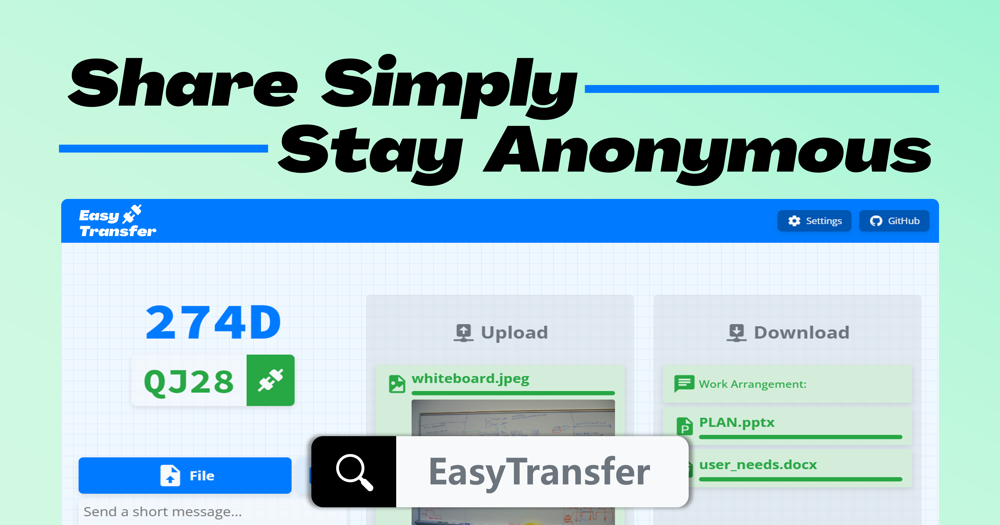

[English](README.md) | 简体中文

EasyTransfer 是一款免费、匿名、加密且易于使用的 E2EE 文件传输工具。您只需访问一个简单的网页，即可使用设备代码连接到**任何网络**中的**任何设备**。

本项目使用 WebRTC 和 Vue.js 构建。

## 使用方法

1. 在需要传输文件的两台设备上访问 [EasyTransfer](https://file.ch3nyang.top/)。
2. 将任意一台设备的四位设备代码输入到另一台设备的设备代码输入框中，并点击连接按钮。
3. 等待连接成功后，您可以将文件拖放到网页上的文件区域，或者点击文件区域选择文件。支持一次性发送多个文件。
4. 在设置中，可以自定义 STUN 服务器和 TURN 服务器，或者指定最大连接数。

> [!NOTE]
>
> 更推荐您自行部署一个 STUN/TURN 服务器，以获得更快的速度和更高的稳定性。

## 功能特点

是什么让 EasyTransfer 与众不同？

- 🫣 **匿名**：不需要注册账号，不需要登录，不需要提供任何个人信息
- 🔒 **加密**：默认加密，确保文件传输的安全性
- 🔄 **端到端**：文件直接从发送方传输到接收方，不经过服务器[^1]
- 🌐 **跨网络**：同时支持局域网和公网之间的文件传输
- 🛠️ **易用**：使用四位设备代码连接设备，无任何多余操作
- 📎 **多媒体消息**：支持发送文字及多种文件类型，还支持拍照发送
- ⚙️ **自定义设置**：所有模块均可以自定义及自行部署

## 自行部署

具体部署方法请参照[项目 Wiki](https://github.com/DevXDojo/EasyTransfer/wiki/导航)。

## 贡献本项目

如果您想为本项目贡献代码，请参照[贡献指南](https://github.com/DevXDojo/EasyTransfer/blob/main/CONTRIBUTING.md)。

## 更新日志

请参照 [CHANGELOG](https://github.com/DevXDojo/EasyTransfer/blob/main/CHANGELOG.md)。

[^1]: 在通信双方需要内网穿透时，文件可能会上传到本项目提供的免费 TURN 服务器。您可以自行部署一个可信的 TURN 服务器来避免这种情况。

  
  
Made with ❤️ by the EasyTransfer Team

